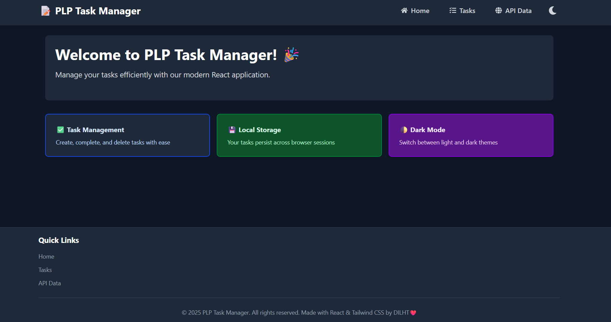
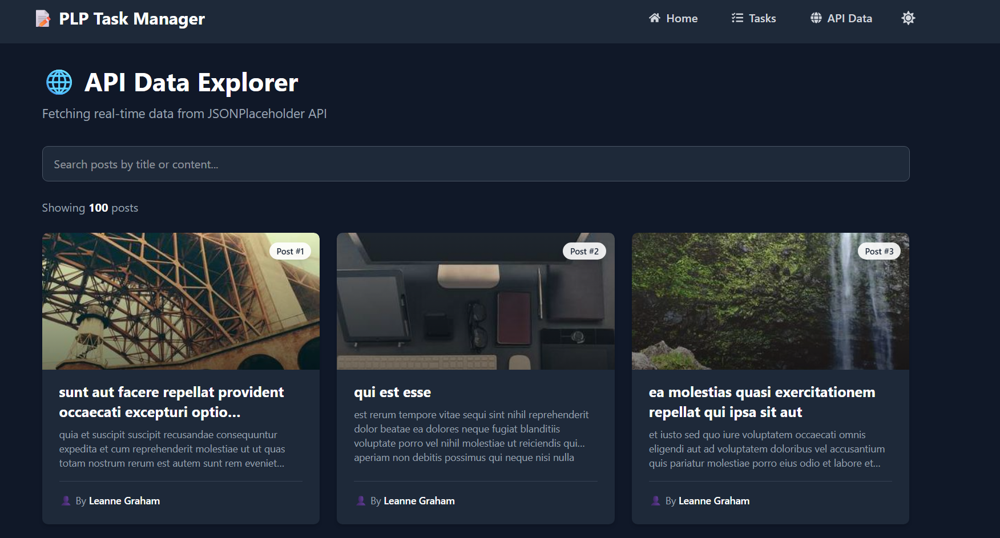

# 📝 PLP Task Manager

A modern React application for managing daily tasks with API integration, built with React, Vite, and Tailwind CSS.



## ✨ Features

- ✅ **Task Management**: Create, complete, and delete tasks with persistent storage
- 🌐 **API Integration**: Fetch and display posts from JSONPlaceholder API
- 🔍 **Search Functionality**: Filter posts by title or content
- 🌓 **Dark Mode**: Toggle between light and dark themes
- 📱 **Responsive Design**: Works seamlessly on mobile, tablet, and desktop
- 🎨 **Modern UI**: Beautiful interface with Tailwind CSS and smooth animations

## 🚀 Live Demo

🔗 **Deployed URL**: [Your Vercel/Netlify URL here]

## 📸 Screenshots

### Home Page


### Task Manager


### API Data Explorer


### Dark Mode


## 🛠️ Technologies Used

- **React 19** - UI library
- **Vite** - Build tool and dev server
- **Tailwind CSS v4** - Utility-first CSS framework
- **React Router** - Client-side routing
- **React Icons** - Icon library
- **JSONPlaceholder API** - Fake REST API for testing
- **Picsum Photos** - Placeholder images

## 📦 Installation

### Prerequisites
- Node.js (v18 or higher)
- npm or yarn

### Setup Steps

1. **Clone the repository**
```bash
   git clone [your-github-classroom-repo-url]
   cd [your-repo-name]
```

2. **Install dependencies**
```bash
   npm install
```

3. **Create environment file**
   
   Create a `.env` file in the project root:
```env
   VITE_APIBASE_URI=https://jsonplaceholder.typicode.com
```

4. **Start development server**
```bash
   npm run dev
```

5. **Open in browser**
```
   http://localhost:5173
```

## 📁 Project Structure
```
src/
├── api/                  # API service functions
│   └── posts.js
├── components/           # Reusable UI components
│   ├── Button.jsx
│   ├── Card.jsx
│   ├── Footer.jsx
│   ├── NavBar.jsx
│   └── TaskManager.jsx
├── context/              # React Context providers
│   └── ThemeContext.jsx
├── hooks/                # Custom React hooks
│   └── LocalStorageTask.jsx
├── layouts/              # Layout components
│   └── Layout.jsx
├── pages/                # Page components
│   ├── Home.jsx
│   ├── TaskPage.jsx
│   └── ApiDataPage.jsx
├── util/                 # Utility components
│   └── NavLinks.jsx
├── App.jsx               # Main app component
└── main.jsx              # Entry point
```

## 🎯 Features Breakdown

### Task Manager
- **Add Tasks**: Type and press Enter or click "Add Task"
- **Complete Tasks**: Check/uncheck tasks to mark completion
- **Delete Tasks**: Remove tasks permanently
- **Filter Tasks**: View All, Active, or Completed tasks
- **Persistence**: Tasks saved to localStorage

### API Data Explorer
- **Fetch Posts**: Retrieves 100 posts from JSONPlaceholder API
- **Search**: Real-time filtering by title or content
- **Beautiful Images**: Integrated with Picsum Photos
- **Responsive Grid**: 1/2/3 columns based on screen size
- **Error Handling**: Retry mechanism if API fails

### Theme Switcher
- **Light/Dark Mode**: Toggle with sun/moon icon in navbar
- **Persistent**: Theme preference saved to localStorage
- **System Integration**: Follows Tailwind's dark mode conventions

## 🧪 Testing

Run the development server and test:
- ✅ Task creation, completion, deletion
- ✅ Task filtering (All/Active/Completed)
- ✅ Search functionality in API Data page
- ✅ Theme toggle (light/dark mode)
- ✅ Responsive design (resize browser)
- ✅ Navigation between pages

## 🚀 Deployment


## 📝 Assignment Requirements Met

- ✅ Task 1: Project Setup with Vite and Tailwind CSS
- ✅ Task 2: Reusable Components (Button, Card, Navbar, Footer)
- ✅ Task 3: State Management with Hooks (useState, useEffect, useContext, custom hook)
- ✅ Task 4: API Integration with loading/error states and search
- ✅ Task 5: Responsive Design with Tailwind CSS and dark mode

## 👨‍💻 Author

**Daniel Kasambala**
- GitHub: [@DILHT](https://github.com/DILHT)
- Assignment: PLP Week 3 - React.js & Tailwind CSS

## 📄 License

This project is part of the PLP Academy curriculum.

## 🙏 Acknowledgments
- Dedan Okware 
- PLP Academy for the learning opportunity
- JSONPlaceholder for the free API
- Picsum Photos for placeholder images
- React and Tailwind CSS communities